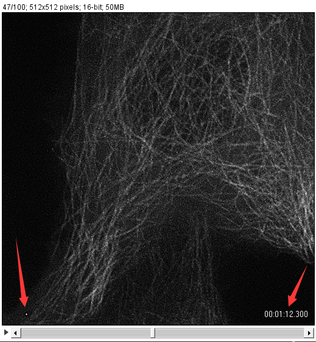
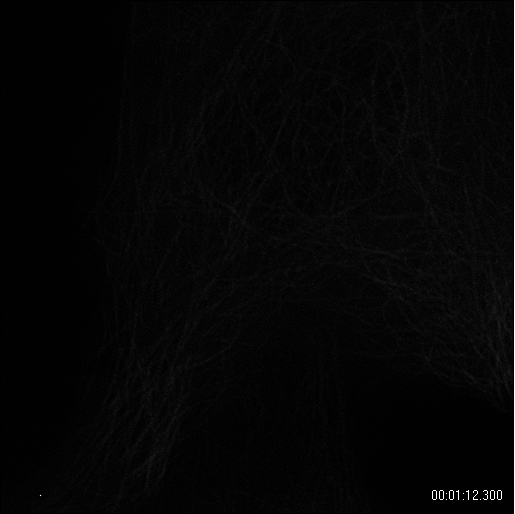
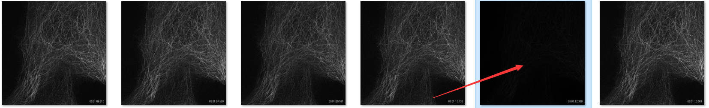
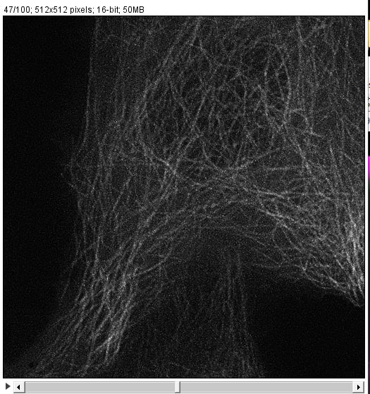

## Adaptive Median fiter (AMF) - imageJ plugin
## Motivation
Confocal type images often exhibit isolated pixels (1×1 ~ 5×5) with extremely bright values caused by voltage instability or dead or hot camera pixels. The magnitudes of these pixels are approximately 5 to 100 times higher than the normal intensity amplitudes of the biostructure. These isolated pixels are ill-suited for the post analyse or processing. We created an adaptive median filter to remove these improper pixels. More specifically, instead of the normal median filter, which replaces each pixel with the median of the neighboring pixels in the window, we set a threshold for our developed adaptive median filter. If the pixel intensity is larger than threshold × median in the window, the pixel is replaced by the median; otherwise, the window moves to the next pixel. By using this method, we can filter the isolated pixels without blurring the images.

Also, the uncleaned slides can lead to this problem.

This plugin will handle this type of problems easily without any blurring or re-doing experiments.
## Installation
### 1. Add the [Adaptive_Median_Filter-0.1.0.jar](https://github.com/WeisongZhao/AdaptiveMedian.imagej/releases/download/v0.1.0/Adaptive_Median_Filter-0.1.0.jar) to your imageJ plugin folder as usual and it will show up in `process -> Adaptive median filter`:

    

#### The window and weight to filter the pulse pixels. Radius should be odd `3, 5 or 7`. Threshold should be `2~20`.
## Example

    

#### As the images visualized with imageJ is processed already with histogram equalization, it seems nothing serious to us (red arrows). However, as long as we want to further process the data, it will influence much to us.  
### **The saved data:**

    

#### If you save the image sequence (one by one) in windows (or Unix system), the image preview of OS (without histogram equalization) will show this problem clearly.

    

## No pulse and without blurring.

    

<b>Plans</b>

- The padarray of image edge;
- The accelerated version of AMF.

