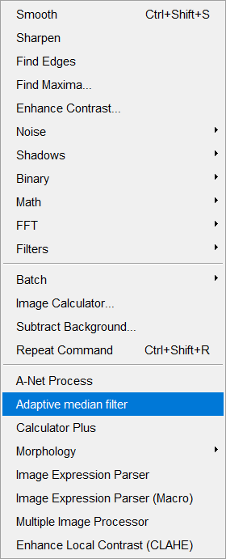

## Adaptive Median fiter - imageJ plugin
## Motivation
The pulse pixels exsiting in images because of various reasons （bad pixels）, and it happens offenly in confocal stype microscopes.
Also, the uncleaned slides can lead to this problem.
This plugin will handle this type of problems easily withou any blurring or re-doing experiments.
## Installation
### 1. Add the [Adaptive_Median_Filter-0.1.0.jar](https://github.com/WeisongZhao/AdaptiveMedian.imagej/releases/download/v0.1.0/Adaptive_Median_Filter-0.1.0.jar) to your imageJ plugin folder as usual and it will show up in `process -> Adaptive median filter`:

    

### 2. UI

    

#### The window and weight to filter the pulse pixels. Radius should be `3 or 5`. Threshold should be `1~10`.
## Example

    

#### As the images visualized with imageJ is processed already with histogram equalization, it seems nothing serious to us(red arrows). However, as long as we want to futher process the data, it will influence much to us.  
### **The saved data:**

    

    

# Filtered Result:

    

## No pulse and no time bar.